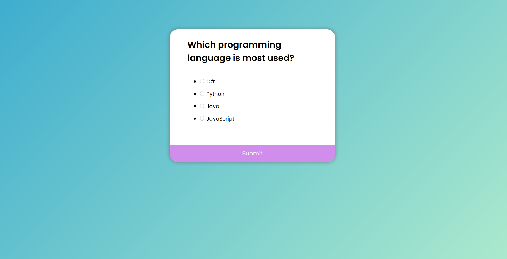

<h1 align="center">
    
</h1>

<p align="center">
  <a href="#technologies">Technologies</a>&nbsp;&nbsp;&nbsp;|&nbsp;&nbsp;&nbsp;
  <a href="#-layout">Getting started</a>&nbsp;&nbsp;&nbsp;|&nbsp;&nbsp;&nbsp;
  <a href="#-project">Project</a>&nbsp;&nbsp;&nbsp;|&nbsp;&nbsp;&nbsp;
  <a href="#-layout">Layout</a>&nbsp;&nbsp;&nbsp;&nbsp;&nbsp;&nbsp;
</p>

<br>

## 🧪 Technologies

This project was developed using the following technologies:

- [HTML](https://www.w3schools.com/html/)
- [CSS](https://www.w3schools.com/css/)
- [JavaScript](https://developer.mozilla.org/en-US/docs/Web/JavaScript)

## 🚀 Getting started

Clone the project and access the folder

```bash
$ git clone https://github.com/italotorreslima/quizapp && cd quizapp
```

## 💻 Project

[QuizApp](https://quizapp-iota.vercel.app/) to bring you even closer to the project! 💜

This is a project inspired by **[Florin Pop](https://www.youtube.com/channel/UCeU-1X402kT-JlLdAitxSMA)** done in April 28, 2021.

## 🔖 Layout

You can view the project layout through the links below:

- [Layout Web](https://www.uidesigndaily.com/posts/sketch-questionnaire-choice-submit-day-924)


---

<p align="center">Projected by Ítalo Torres with 🖤</p>
<p align="center">Readme inspired by Guilherme Capitão</p>

